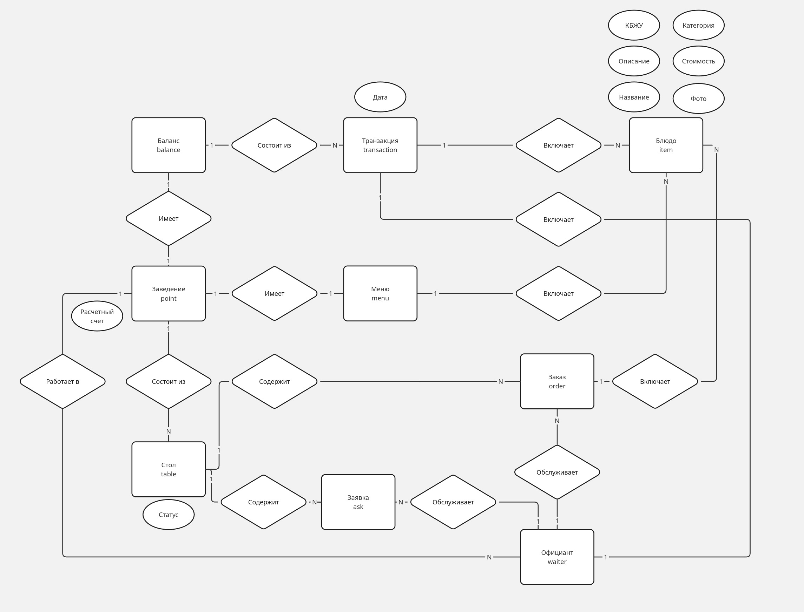
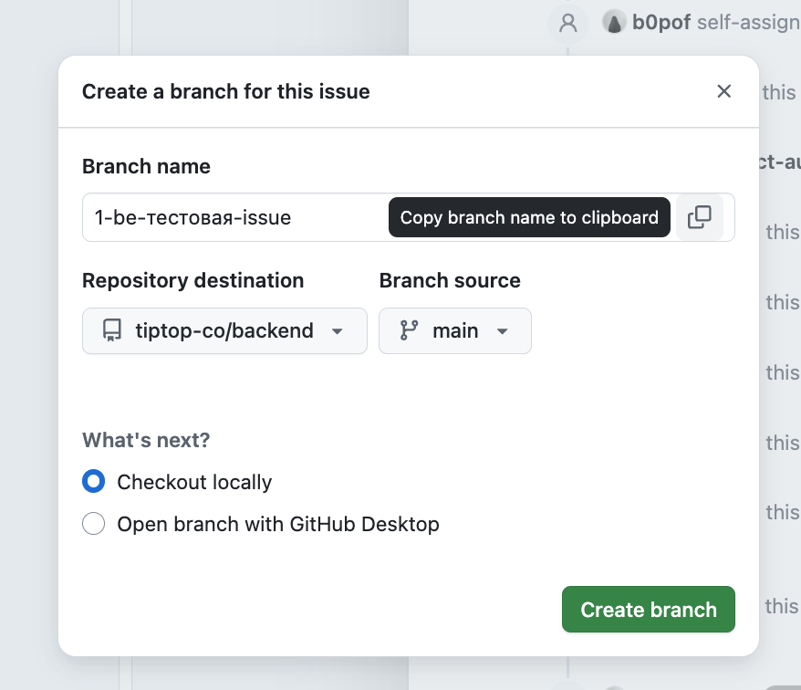
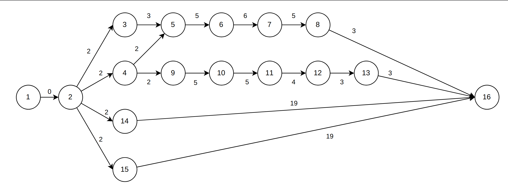

# TipTop

## Продуктовое описание

TipTop — веб-сервис для цифровизации обслуживания в кафе или ресторане. 
Посетители выбирают, заказывают, оплачивают заказ и оставляют чаевые через веб-приложение, доступное по QR-коду.
Официанты отслеживают заказы и заявки посетителей.
Менеджеры получают статистику по обслуживанию и продажам в своих заведениях.

---

### Функциональные требования

#### Ролевая модель

|№ | Пользователь | Авторизаиция |
|---|---|---|
|1| Посетитель | -|
|2|Официант |+ |
|3| Менеджер заведения| +| 
|4|Администратор TipTop | +|

#### Действия посетителя

|№ | Действие | Опциональное поддействие |
|---|---|---|
|1| Просмотреть информацию о блюдах в меню | Отфильтровать блюда по категории (Горячее, десерт и т.д.) |
|2| Выбрать блюда из меню и добавить их в корзину | - |
|3| Просмотреть корзину | - |
|4 | Удалить блюда из корзины | - |
|5| Выбрать блюда из корзины и заказать их |  Указать пожелания к заказу | 
|6| Выбрать блюда из меню оплаты и оплатить их | Оставить чаевые|
|7| Вызвать официанта | - |

- Чаевые адресуются привязанному к столу в данный момент официанту

#### Действия официанта

|№ | Действие | 
|---|---|
|1| Авторизоваться | 
|2| Просмотреть информацию по своим столам | 
|3| Просмотреть информацию по заявкам | 

- Официант связывается со столом в момент совершения на столе первого заказа. Официант остается привязанным к столу до тех пор, пока все заказанные товары не будут оплачены. Связывание происходит автоматически с наименее занятым в данный момент официантом

- Если пользователь не сделал ни одного заказа и создал заявку на вызов официанта, то она адресуется наименее занятому в данным момент официанту

- Если вызов официанта поступает со стола с активным привязанным официантом, то он адресуется именно ему

- Данные для авторизации официант получает от менеджера заведения

#### Действия менеджера заведения

|№ | Действие |
|---|---|
|1| Авторизоваться | 
|2| Добавить в меню блюдо | 
|3| Удалить блюда из меню | 
|4| Удалить блюда из меню | 
|5 | Заполнить информацию о заведении |
|6 | Создать учетную запись для официанта | 
|7 | Удалить учетную запись для официанта | 
|8| Создать QR-код для стола заведения | 
|9| Удалить QR-код для стола заведения | 
|10| Просмотреть статистику по заведению |

- Данные для авторизации менеджер получает от администратора TipTop

#### Администратор TipTop

|№ | Действие | 
|---|---|
|1| Авторизоваться | 
|2| Создать учетную запись для менеджера заведения | 
|3| Удалить учетную запись для менеджера заведения | 
|3| Получить статистику по заведениям  | 

### Интеграции

#### Платежный шлюз ЮКасса

Для имитации платежных операций будет использована интеграция с песочницей от ЮКасса.
Песочница позволяет имитировать реальные финансовые операции, интеграцию с реальным API без необходимости регистрации реальных расчетных счетов.

#### Telegram-бот

> [!NOTE]
> Закладывается, что данный функционал может быть не включен в финальную версию MVP-проекта

Официанты получают уведомления о заявках и заказах через телеграм-бот.

## Глоссарий

### ER-диаграмма

Для сущностей отражены только основные атрибуты

## Заведение

Одна учетная запись менеджера соответствует одному заведению.
В случае, если один пользователь-менеджер владеет несколькими заведениями, то для каждого из них создается своя учетная запись.

## Стол

У стола есть состояние, связанное с наличием заказанных или оплаченных товаров.

Схема состояний стола

* Сущность "сессия стола" отдельно не выделятся
* Стол считается закрытым тогда, когда его список товаров на оплату пуст
* Число посетителей на стол не регулируется в рамках сервиса
* Посетитель может переходить по QR-коду сколь угодно много раз

## Заказ

Схема состояний заказа

* Заказ не может быть отменен

## Транзакция

* За один раз (за одну транзакцию) пользователь может оплатить вариативное число позиций из списка на оплату
* Транзакция создается при инициации оплаты выбранных позиций до отправки запроса в платежный шлюз
* Идемпотентность платежных операций поддерживается за счет ввода уникальный идентификаторов транзакций
* В случае ошибки при проведении оплаты в платежном шлюзе, информация об ошибке фиксируется в системе и пользователю предлагается повторить оплату, транзакция при этом не пересоздается

## Техническое описание

Сервис состоит из двух приложений: 
1. Фронтенд приложение
2. Бекенд приложение

### Бекенд-приложение

- Монолитная архитектура
- Трехуровневая архитектура в рамках монолита (Контроллер, домен, репозиторий)

| Область применения | Технология |
| --- | --- |
| Язык программирования | Golang | 
| СУБД | PostgreSQL |
| Кеш | Redis |
| Хранилище секретов | Vault |
| Хранилище изображений | Minio |
| Визуализация дашбордов, логов | Grafana |
| Логирование | Loki + Promtail |
| Сбор метрик | Prometheus |
| Веб-сервер | Caddy |

### Фронтенд-приложение

- SPA

| Область применения | Технология |
| --- | --- |
| Язык программирования | JavaScript | 
| Фреймворк | React |

## Условия эксплуатации

- Для `PROD` окружения сервер на Ubuntu 22-24 Server
- Развертывание приложений на серверах в Docker контейнерах
- Для пользователя необходим браузер на базе `Chromium`

## Правила выгрузки

- При успешном прохождении пайплайна в основной ветке приложение автоматически развертывается в `PROD` окружении

---

## Процессы

### Отслеживание статусов задач
Задачи (issue) фиксируются на Kanban-доске в [Github issues](https://github.com/orgs/tiptop-co/projects/1/views/1) и в процессе работы над ними переходят по статусам:
1. **TO DO** (после создания)
2. **IN PROGRESS** (после создания ветки)
3. **IN REVIEW** (после создания и публикации ПР)
4. **IN QA** (после аппрува и перед проверкой в STAGE окружении)
5. **DONE**

### Синки

> Ниже в описании используется значение **N**.\
> **N** - длительность интервала между ревизией беклога (что-то вроде спринта).\
> \
> Подберем это значение эмпирически в зависимости от темпа работы над задачами. Начнем с **N = 1**. Если темп работы окажется низким, (т.е. на груминге будет некуда грумить и статусы задач не будут меняться), увеличим значение N до 2.

1. **Груминг беклога**: 1 раз в N недель
   - обсуждаем статусы issue, которые брали в разработку на прошлом груминге
   - архивируем issue, находящиеся в статусе **DONE**
   - формируем беклог issue для выполнения в течение следующих N недель: оцениваем (если требуется) и распредляем issue по исполнителям
2. **Weekly sync (текстом в чатике)** - рассказываем о статусе своих задач: 1 раз в N недель
3. **Tech PBR (Product Backlog Refinement)** - презентация технического решения большой (требующей декомпозиции на инкременты ввиду объема) фичи. Проводится автором ресерча по мере готовности

## Методология работы с git

- Разработка ведется путем создания отдельной **ветки** для каждой задачи.  
- При внесении изменений в кодовую базу в рамках ветки создаются **коммиты**.  
- По готовности задачи создается **Pull Request**.

В данном разделе представлено подробное описание каждого из перечисленных этапов.

### Ветка

Название должно содержать номер issue, отделенный от остальных символов с помощью тире ("-").  
При просмотре issue в интерфейсе отображается саджест для создания ветки, где указано предлагаемое название ветки - можно использовать его.

### Коммит

В процессе разработки можно делать коммиты с любым сообщением, однако перед мерджем необходимо сжать ([git squash](https://www.git-tower.com/learn/git/faq/git-squash)) все временные коммиты в один - его сообщение должно соответствовать формату: `{issue_id}: {описание}`.  
Описание должно быть человекочитаемым и давать максимально общее представление об изменениях (лучше чтобы совпадало с названием задачи).

### Pull request

Содержимое главной ветки (main / master) изменяется только через механизм Pull Request и в любой момент времени содержит рабочую (релизную) версию продукта, приемлемую для отображения пользователю.  
Dev-ветка вливается в главную только при выполнении следующих условий:
1. билды пройдены;  
2. аппрув от как минимум 1 человека из команды, отличного от автора PR;  
3. функционал проверен исполнителем.

Pull request должен быть оформлен по следующим правилам:  
1. добавлен человекочитаемый заголовок формата `{issue_id}: {описание}` (аналогично коммиту);
2. заполнено описание по автоматическому шаблону (будет добавлен в проект, планируются 2 секции: `Зачем`, `Что`).

## PERT-диаграмма

**Пояснение к диаграмме**

| Номер задачи | Название                                              | Длительность | Начало                 | Окончание               | Предшественники |
|--------------|------------------------------------------------------|--------------|------------------------|--------------------------|-----------------|
|              | TipTop                                               | 24 дней      | 02 Март 2026 9:00      | 02 Апрель 2026 18:00     |                 |
| 1            | Начало проекта                                       | 0 дней       | 02 Март 2026 9:00      | 02 Март 2026 9:00        |                 |
| 2            | Подготовка репозиториев и CI/CD                      | 2 дней       | 02 Март 2026 9:00      | 03 Март 2026 18:00       | 1               |
| 3            | Настройка инфраструктуры (redis, minio, vault, DB)   | 3 дней       | 04 Март 2026 9:00      | 06 Март 2026 18:00       | 2               |
| 4            | Создание ER-диаграммы и схемы таблиц                 | 2 дней       | 04 Март 2026 9:00      | 05 Март 2026 18:00       | 2               |
| 5            | Разработка бекенд API                                | 5 дней       | 09 Март 2026 9:00      | 13 Март 2026 18:00       | 3;4             |
| 6            | Реализация заказов и корзины                         | 6 дней       | 16 Март 2026 9:00      | 23 Март 2026 18:00       | 5               |
| 7            | Реализация транзакций и интеграции с ЮКассой         | 5 дней       | 24 Март 2026 9:00      | 30 Март 2026 18:00       | 6               |
| 8            | Реализация логики столов и привязки официанта        | 3 дней       | 31 Март 2026 9:00      | 02 Апрель 2026 18:00     | 7               |
| 9            | Реализация базовой навигации и меню                  | 5 дней       | 06 Март 2026 9:00      | 12 Март 2026 18:00       | 4               |
| 10           | Реализация корзины и оформления заказа               | 5 дней       | 13 Март 2026 9:00      | 19 Март 2026 18:00       | 9               |
| 11           | Реализация оплаты и чаевых                           | 4 дней       | 20 Март 2026 9:00      | 25 Март 2026 18:00       | 10              |
| 12           | Реализация интерфейса для официанта                  | 3 дней       | 26 Март 2026 9:00      | 30 Март 2026 18:00       | 11              |
| 13           | Реализация интерфейса для менеджера                  | 3 дней       | 31 Март 2026 9:00      | 02 Апрель 2026 18:00     | 12              |
| 14           | Тестирование                                         | 19 дней      | 02 Март 2026 9:00      | 02 Апрель 2026 18:00     | 2               |
| 15           | Написание документации                               | 19 дней      | 02 Март 2026 9:00      | 02 Апрель 2026 18:00     | 2               |
| 16           | Конец проекта                                        | 0 дней       | 02 Апрель 2026 18:00   | 02 Апрель 2026 18:00     | 8;13;14;15     |

## Таблица рисков

|   ID   | Риск + описание                                                                                                                                       |            Этап             | Вероятность (1-5) | Урон (1-5) | **Приоритет (В\*У)** | Состояние | Признак                                                                                                                  | План реакции                                                                                                                                                                  | Превентивные меры                                                                                                                                                               | Стратегия                      | Ответственный               |
|:------:|:------------------------------------------------------------------------------------------------------------------------------------------------------|:---------------------------:|:-----------------:|:----------:|:--------------------:|:---------:|:-------------------------------------------------------------------------------------------------------------------------|:------------------------------------------------------------------------------------------------------------------------------------------------------------------------------|:--------------------------------------------------------------------------------------------------------------------------------------------------------------------------------|:-------------------------------|:----------------------------|
| **1**  | **Поздний запуск продукта**. Отсутствие приоритезации задач, большие трудозатраты на задачи, не входящие в MVP.                                       |           Запуск            |         3         |     4      |          12          |  Анализ   | За 2 недели до релиза не имеем работающего (пусть и с багами) продукта в Staging окружении.                              | Выделение резерва в несколько недель. Выявление оставшихся для выполнения задач критического пути, максимальное возможное сокращение их объема, выполнение в ближайшее время. | Выявления задач, выполнение которых необходимо для запуска MVP, обсуждение необязательной части.                                                                                | Снижение + Принятие (активное) | b0pof                       |
| **2**  | **Баги в Prod**. Ошибки в логике, заметные для пользователя в UI.                                                                                     |        Эксплуатация         |         3         |     3      |          9           |  Анализ   | Жалобы пользователей или заметные ошибки поведения продукта при проверке на Prod.                                        | Откат последнего релиза или отключение функционала и hotfix (если релиз ломает CJM), создание задачи на фикс и ее выполнение в порядке в зависимости от приоритета бага.      | Ручное тестирование каждой задачи на Staging. Если задача не может быть протестирована отдельно от другой(-их), необходимо проводить регрессивное тестирование                  | Снижение                       | *team*                      |
| **3**  | **Блокирующая зависимость разработки клиента от серверного API**. Разработка клиента невозможна/затруднена из-за отсутствия рабочего API.             |         Разработка          |         3         |     2      |          6           |  Анализ   | Разработка клиента заблокирована бекендом.                                                                               | Описание контракта на беке и публикация Swagger для импорта на клиент.                                                                                                        | Учитывать блокирующие связи между задачами. Генерировать контракт до написания кода с логикой, при необхдимости отдавать моковые данные до готовности полноценного функционала. | Устранение                     | *team*                      |
| **4**  | **Ошибки интеграции фронтенда и бекенда**. Несогласованность контрактов или правил их восприятия.                                                     |         Разработка          |         4         |     2      |          8           |  Анализ   | В процессе интеграции возникает конфликт контрактов или поля используются не по назначению на клиенте.                   | Откат последнего релиза (если на Prod), устранение конфликтов.                                                                                                                | Описываем контракт в задаче, в первую очередь генерируем Swagger на бекенде и утверждаем с клиентом, в будущем следуем договоренностям и обсуждаем необходимые изменения.       | Устранение                     | *team*                      |
| **5**  | **Конфликты миграций БД / потеря данных**                                                                                                             |        Эксплуатация         |         2         |     5      |          10          |  Анализ   | Данные пропали из БД (например, удалился docker volume) или ошибки при накатывании миграций.                             | Восстанавливать данные, резолвить конфликты миграций вручную.                                                                                                                 | Используем миграции с версионированием, продумываем возможность хранения бекапов данных на Read-Only репликах, находим надежные способы внеднерия технологий в проект.          | Снижение                       | humanbelnik                 |
| **6**  | **Неконсистентность структуры проекта**. Разработчики не соблюдают единый стиль, что влияет на скорость изучения кодовой базы.                        |         Разработка          |         3         |     2      |          6           |  Анализ   | Изучение кодовой базы отнимает более 20% от всего времени работы над задачей                                             | При выполнении задачи обратиться за помощью к автору кода с трудночитаемой логикой.                                                                                           | Составить набор правил написания кода, в которые входит достаточная декомпозиция компонентов, а также осознанный нейминг переменных, типов данных и функций/методов.            | Снижение                       | *team*                      |
| **7**  | **Упор на чистый код в ущерб TTM (Time to Market)**. Задачи выполняются медленно за счет низкоуровневого проектирования.                              |         Разработка          |         2         |     3      |          6           |  Анализ   | Размышление / обсуждение занимает больше времени, чем реализация.                                                        | Создание договоренностей о структуре проекта и типе архитектуры, которой придерживаемся при написании кода.                                                                   | Выбирать наиболее простое решение (или оставлять текущее) и закреплять инсайты на будущее для избежания повторений.                                                             | Устранение                     | *team*                      |
| **8**  | **Логические ошибки в сложных компонентах системы**. Ввиду большего количества тест-кейсов не удается проверить все сценарии при ручном тестировании. | Тестирование / Эксплуатация |         2         |     4      |          8           |  Анализ   | Выявляются баги в компонентах с большой цикломатической сложностью или специфичной (трудновоспроизводимой) логикой.      | Фиксить, покрывая подобные компоненты unit-тестами.                                                                                                                           | Пишем тесты на компоненты со сложной (ветвистой) логикой.                                                                                                                       | Снижение                       | *team*                      |
| **9**  | **Критические ошибки в релизе**. Баги, приводящие к downtime или оказывающие критическое влияние на CJM**.                                            |        Эксплуатация         |         3         |     5      |          15          |  Анализ   | Падение сервиса / Пользователь не может выполнить необходимые шаги.                                                      | Откат последнего релиза.                                                                                                                                                      | Предусматриваем хранение 10 последних образов сервиса для быстрого откатывания изменений.                                                                                       | Снижение                       | humanbelnik                 |
| **10** | **Неудобный UI/UX**. Элементы UI сливаются друг с другом, пользователь не до конца понимает что нужно сделать для удовлетворения своих потребностей.  | Тестирование / Эксплуатация |         2         |     1      |          2           |  Анализ   | При пользовании продуктом возникают трудности ввиду сложности интерфейса или кол-ва необходимых для выполнения действий. | Изменить тексты / цвета интерфейса (или что-нибудь еще, что не затрагивает бизнес-логику) и запланировать исследование проблемы.                                              | Периодически проводить исследования, собирая фидбек от пользователей, не имеющих отношения к разработке продукта.                                                               | Снижение                       | b0pof, taucuya, hahaclassic |
| **11** | **Изменения в бизнес-логике требуют большого эффорта**.                                                                                               |         Разработка          |         5         |     2      |          10          |  Анализ   | Для изменения поведения доменных сущностей (например, статусной модели) требуется внести много правок.                   | Внести правки с минимальными затратами по времени, при этом соблюдая правила написания кода.                                                                                  | Создавать доменные сущности, предусматривая возможные изменения в будущем и упрощая логику за счет формализации бизнес-правил, инкапсулируя их от кода сервиса (юзкейсов).      | Снижение                       | *team*                      |

